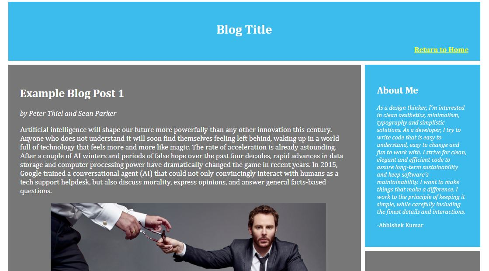

# Personal Blog Website

## About the Project
This project requires to utilize HTML and CSS skills to build out a personal blog website (fictitious), including custom images, layout, and styling. Along with webpage design considerations, there is appropriate structuring of files, as well as using proper CSS and HTML formatting & style.

### CSS Flexbox vs CSS Grid
The goal of this project is to build responsive website using powerful Flexbox and Grid concepts which is the new paradigm of front-end design.

Flexbox is essentially for laying out items in a single dimension – in a row OR a column. Grid is for layout of items in two dimensions – rows AND columns
 

*CSS Grid excels in creating layouts for the webpage. Flexbox is the master of content flow for each element*

### Which is better - Flexbox or Grid?
CSS Flexbox has become extremely popular amongst front-end developers in the last couple of years. This isn’t surprising, as it has made it a lot easier for us to create dynamic layouts and align content within containers.
However, there’s a new ferature in town called CSS Grid, and it’s got a lot of the same capabilities as Flexbox. In come cases it’s better than Flexbox, while in other cases it’s not.

#### *CSS Grid excels in creating layouts for the webpage. Flexbox is the master of content flow for each element*

This seems to be a source of confusion for developers. Each can achieve what the other is not capable of. So, in this project we have used both in harmony to build a scalable and responsive layout. 
